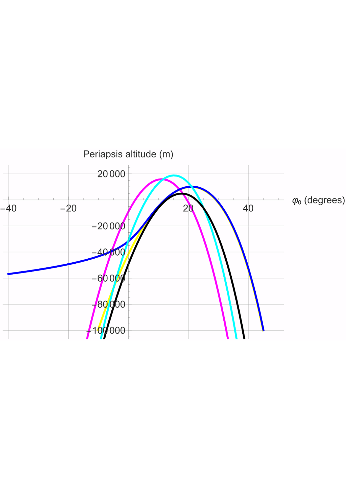
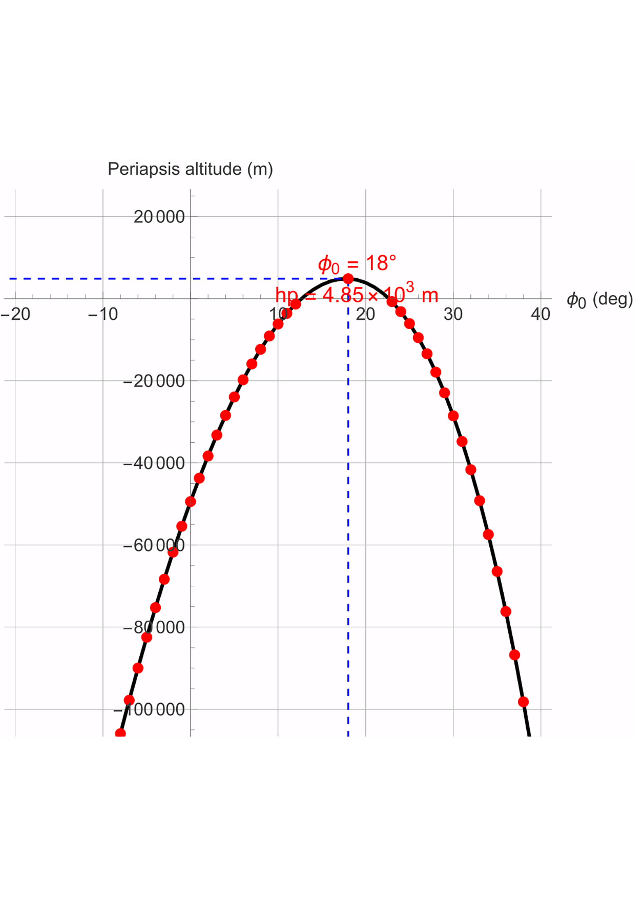
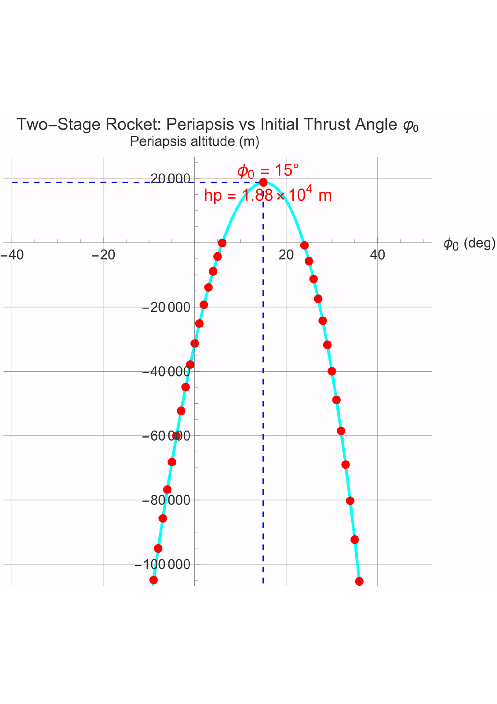
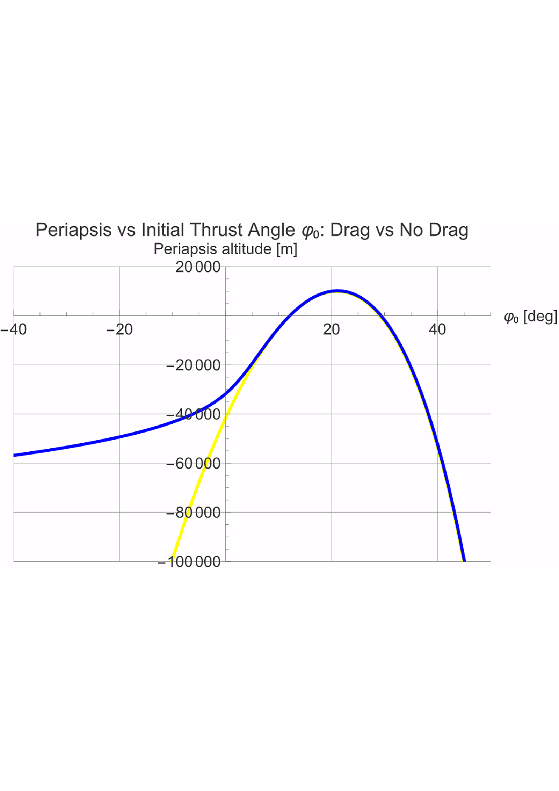
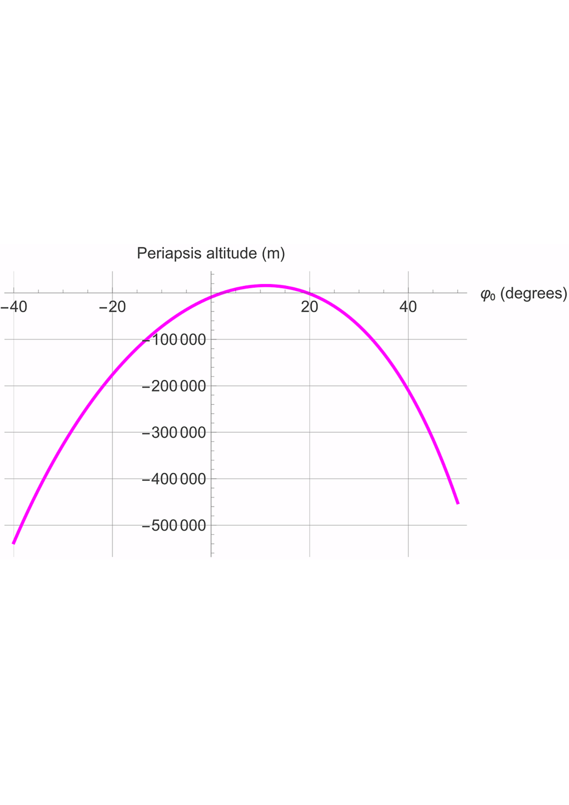
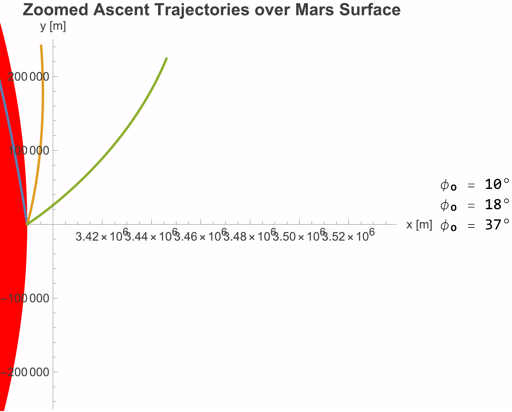
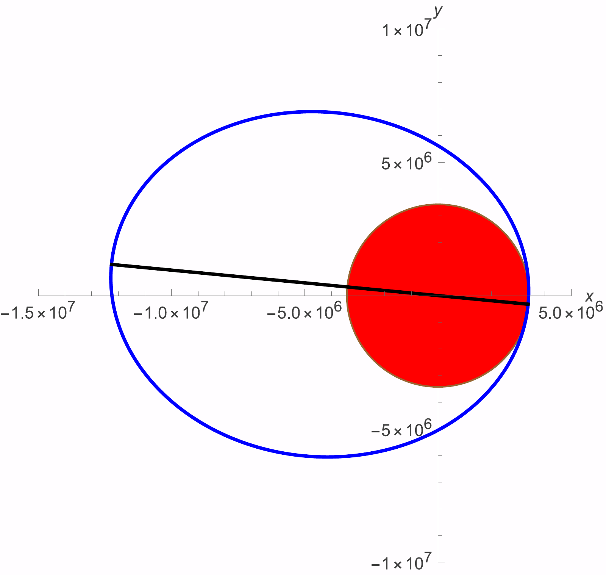

# Mars Ascent Vehicle: Solid Propellant Staging

*Individual project · AE 401 Rocket Propulsion · Izmir University of Economics · Jan 2026*

## Engineering question
How should a two-stage solid propellant ascent vehicle for Mars Sample Return be sized?

## Approach
- Tsiolkovsky equation, mass budgeting and staging optimisation (equal and unequal stages).
- Martian atmospheric drag, dynamic pressure and drag force along the ascent.

## Results
- Stage sizing and staging trade documented in the report.
- The periapsis altitude depends strongly on the initial thrust angle φ0: a higher thrust angle gives a higher periapsis.
- Staging improves performance by reducing the vehicle mass during ascent, which raises the periapsis.
- Martian atmospheric drag reduces the reachable altitude, especially early in the ascent.
- Unequal staging with drag lowers the periapsis further, but a two-stage vehicle still outperforms a single-stage one.

## Figures
Figures are from the report and notebook. The PDF originals are kept in `figures/` next to each PNG.

*Figure 3 of the report: periapsis altitude vs initial thrust angle φ0 for various launch configurations.*

*Single stage: periapsis altitude vs initial thrust angle φ0 (maximum near φ0 = 18°).*

*Two-stage rocket: periapsis altitude vs initial thrust angle φ0.*

*Periapsis altitude vs initial thrust angle φ0, with and without atmospheric drag.*

*Periapsis altitude with unequal stages and atmospheric drag.*

*Zoomed ascent trajectories over the Mars surface for initial thrust angles φ0 = 10°, 18° and 37°.*

*Major axis of the orbit, oriented by the argument of periapsis ω (from the eccentricity vector).*

## Repository contents
- `notebooks/`: Wolfram Language Jupyter notebooks (outputs saved, so results display directly on GitHub)
- `report/`: written report (PDF)
- `figures/`: key figures (PDF originals with PNG copies for display on GitHub)

## How to run
The notebooks use the Wolfram Language kernel for Jupyter (WolframLanguageForJupyter, Wolfram Engine or Mathematica 14).

## Credits
This project was completed on a course notebook framework by **Prof. Fabrizio Pinto** (Izmir University of Economics), released under CC BY 4.0. The completed notebook, results and written report in this repository are my own work.

## License
CC BY 4.0, consistent with the original course material. Please credit both Prof. Fabrizio Pinto and Kaoutar Ammara.

Kaoutar Ammara · Aerospace Engineer · [GitHub](https://github.com/Kiwiiiieee) · [LinkedIn](https://linkedin.com/in/kaoutar-ammara)
